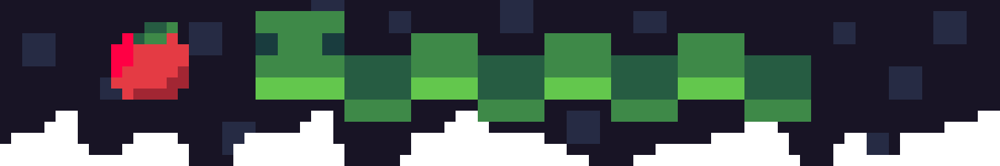

<h1 align=center>🐍 sonolus Snake Engine 🐍</h1>

 <i>My attempt at making a <b>basic snake game</b> for <a href="https://sonolus.com/">Sonolus</a>. </i>

  

Try it now at: https://lbo44.github.io/Sonolus-Snake-Engine ! (Or click [this link](https://open.sonolus.com/lbo44.github.io/Sonolus-Snake-Engine) to directly open it in the Sonolus app.)
This project is far from perfect, but Play and Replay modes are working properly so I consider it complete.

## 📋 Things I might try to do:

- [x] find good enough sfx 🎵
- [x] replay mode (I have no clue how)
  - [x] properly load the movement data
  - [x] load the apples in the correct order
  - [x] draw the whole snake body
  - [x] add progress bar to allow jumping to any moment of the replay
  - Update: Now that Watch Mode is done, I realize those steps don't really make sense 😅
- [x] improve visuals ✨
  - [x] fix death animation
  - [x] screen shake/vibration
  - [x] make the eyes randomly blink
  - [x] ~~apple eating animation~~ particles will do
- [x] tutorial mode (maybe?) 📖
- [x] ~~create a very basic static website~~
- [ ] ~~host an actual server 🌐~~ Will likely never happen
  - [ ] create and host a sonolus express server
  - [ ] support uploading replays
  - [ ] add leaderboards

## 🔗 Links:

- [Coconut Games](https://coconut.sonolus.com/games/) 🥥
- [Sonolus Website](https://sonolus.com/)
- [Sonolus Wiki](https://wiki.sonolus.com)
- [Sonolus Server Web](https://github.com/Sonolus/sonolus-server-web)
- This repository is based on [Sonolus.js Template (TS)](https://github.com/Sonolus/sonolus.js-template-ts)
